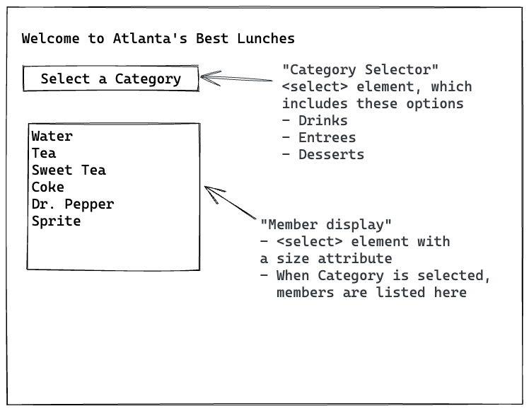

# Workbook 4 Mini Project Planning

## Requirements

- Design a web page

  - User can select a category of menu items
    - Categories are "Drinks", "entrees", "desserts"
  - When user selects a category, see the category members displayed in a list box
    - For example: When user clicks on "Drinks", page shows "Water", "Tea", etc.

- Page Elements:
  - Category Selector
    - Contains top level categories (drinks, entrees, desserts)
    - Can be _statically_ coded, meaning we don't need to create these options in JavaScript. We can create these three options in HTML.
  - Member Display
    - Displays members of the selected category
    - Members will be loaded using JavaScript
      - Loaded when user clicks on category
      - Handler should be assigned to `onchange` of Category Selector

Source data:

```javascript
let menu = {
  // Category (shown in Category selector)
  drinks: [
    // Category members (go into member display)
    'Water',
    'Tea',
    'Sweet Tea',
    'Coke',
    'Dr. Pepper',
    'Sprite',
  ],

  // Category (shown in Category selector)
  entrees: [
    // Category members (go into member display)
    'Hamburger w/ Fries',
    'Grilled Cheese w/ Tater Tots',
    'Grilled Chicken w/ Veggies',
    'Chicken Fried Steak w/ Mashed Potatoes',
    'Fried Shrimp w/ Coleslaw',
    'Veggie Plate',
  ],

  // Category (shown in Category selector)
  desserts: [
    // Category members (go into member display)
    'Cheesecake',
    'Chocolate Cake',
    'Snickerdoodle Cookie',
  ],
};
```

### Example of statically coded HTML category selector

```html
<select id="categorySelector">
  <option value="">Select a Category</option>
  <option value="drinks">Drinks</option>
  <option value="entrees">Entrees</option>
  <option value="desserts">Desserts</option>
</select>
```

## Wireframe



## Approach

- [ ] Create HTML page (Workbook 1)

  - (includes basic HTML skeleton)
  - Includes Category Selector
    - Can have its options hard-coded into HTML
  - Includes Member display
    - Has no hard-coded options. They are populated dynamically by JavaScript
  - includes link to JS file

- [ ] Create JS File

  - Smoke test it (does JS file load? log hello world or something)

- [ ] Create an **empty** category selector function

  - AKA - "Event Handler"
  - Fired when you change categories
    - Smoke test this event: Make sure that you can log something to the console whenever the category changes
  - **References**
    - onchange event: Page 3-14 of Workbook 4

- Start fleshing out category selector function:

  - [ ] Log out which category was selected

    - **References**
      - page 3-8 of Workbook 4

  - [ ] Using that selected value, can you log the appropriate members to the console?

    - Assuming option values correspond to `menu` object keys, use `categorySelectorEl.value` to get members from the menu object
    - **References**
      - Workbook 4 page 3-8 for info about determining option selected
      - Workbook 4 page 1-5 for JS Objects
      - Workbook 4 page 2-11 for Arrays

  - [ ] Create \<option> elements using the members that you've retrieved
    - **References**
      - Looping through arrays: Workbook 4 page 2-15
      - Loading select element from array: Workbook 4 page 3-4
